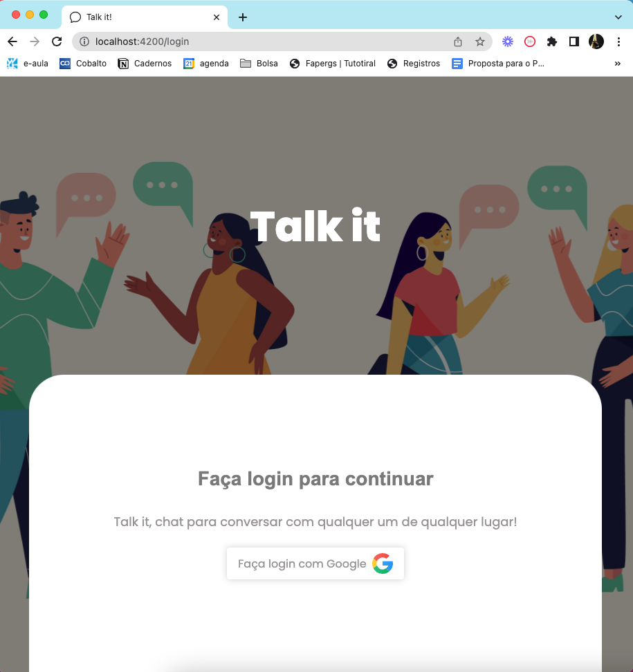
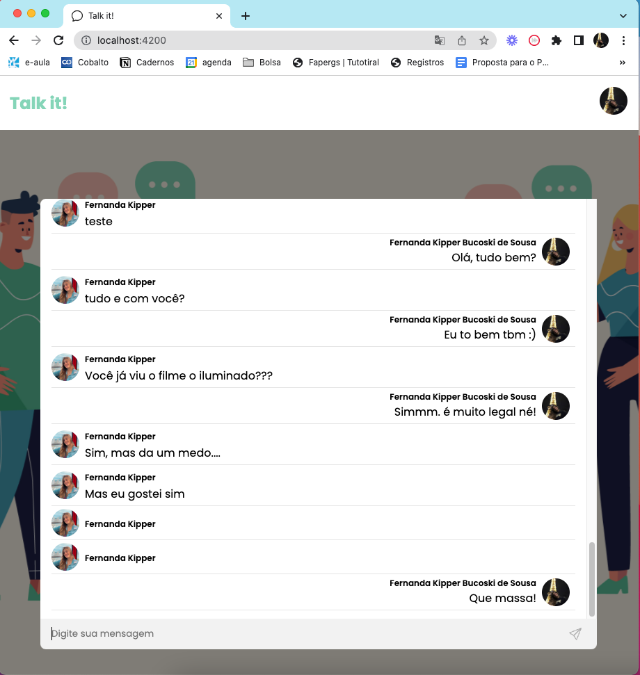

<h1 align="center"></h1>
<h2 align="center">Version 2</h2>

<p align="center">
 <a href="#clone">Clone</a> • 
  <a href="#contribute">Contribute</a> •
 <a href="#license">License</a>
</p>

<p align="center">
<b>Single-channel Live Chat built in Angular using Firebase integration, which users can log in with their Google account and chat with everyone online!</b>
</p>
<p align="center">
  
  
</p>

<h2 id="clone">Clone</h2>

<h4> Prerequisites</h4>

- Node v16.13.2
- npm v8.1.2
- Angular CLI v14.0.4

<h4>Starting</h4>

```
git clone https://github.com/Fernanda-Kipper/chat-app.git
cd chat-app
npm install
ng serve
$OPEN http://localhost:4200
```

### Atention 🛑

It is not recommended to store your API access keys on the client side, in this project the angular environment configs were used strictly for study and practice, but in production mode this practice is not recommended

<h2 id="contribute">Contribute 🚀</h2>

If you want to contribute, clone this repo, create your work branch and get your hands dirty!

```bash
git clone https://github.com/Fernanda-Kipper/chat-app.git
git checkout -b feature/NAME
```

After development

```bash
git push origin feature/NAME
```

 And then, open a Pull Request explaining the problem solved or feature made, if exists, append screenshot of visual modifications and wait for the review!

[How to create a Pull Request](https://www.atlassian.com/br/git/tutorials/making-a-pull-request)

[Commit pattern](https://gist.github.com/joshbuchea/6f47e86d2510bce28f8e7f42ae84c716)


<h2 id="license">License 📃 </h2>

This project is under [MIT](LICENSE) license

